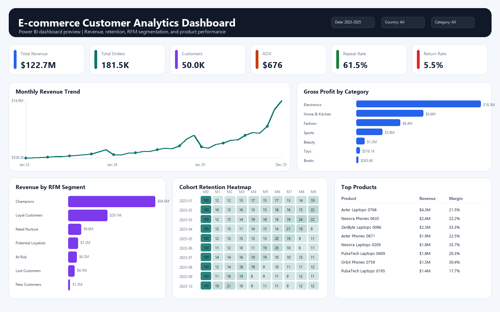
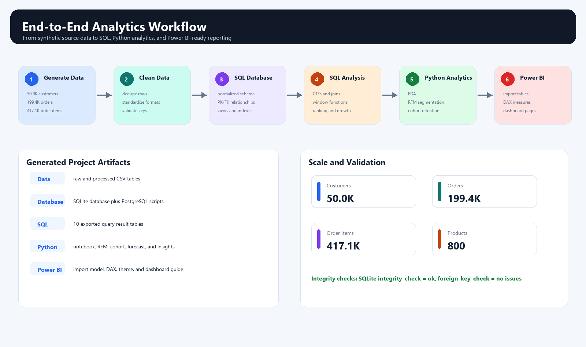
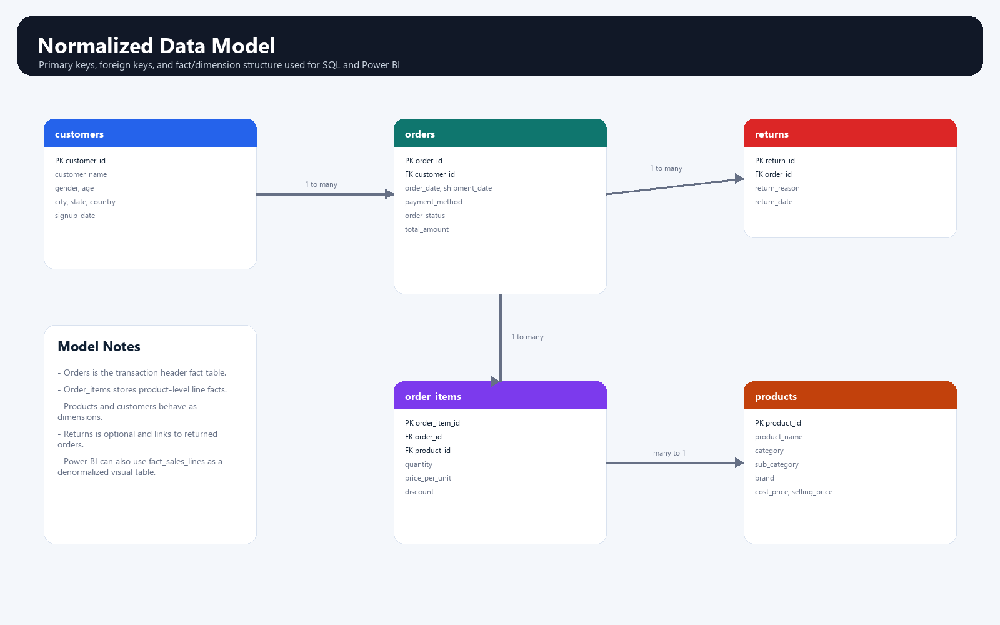
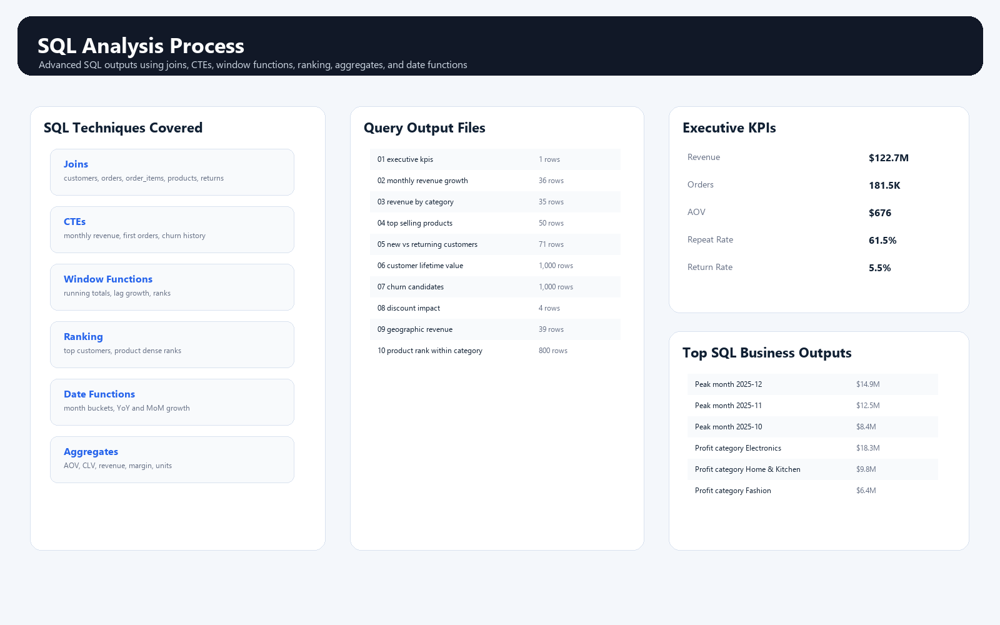
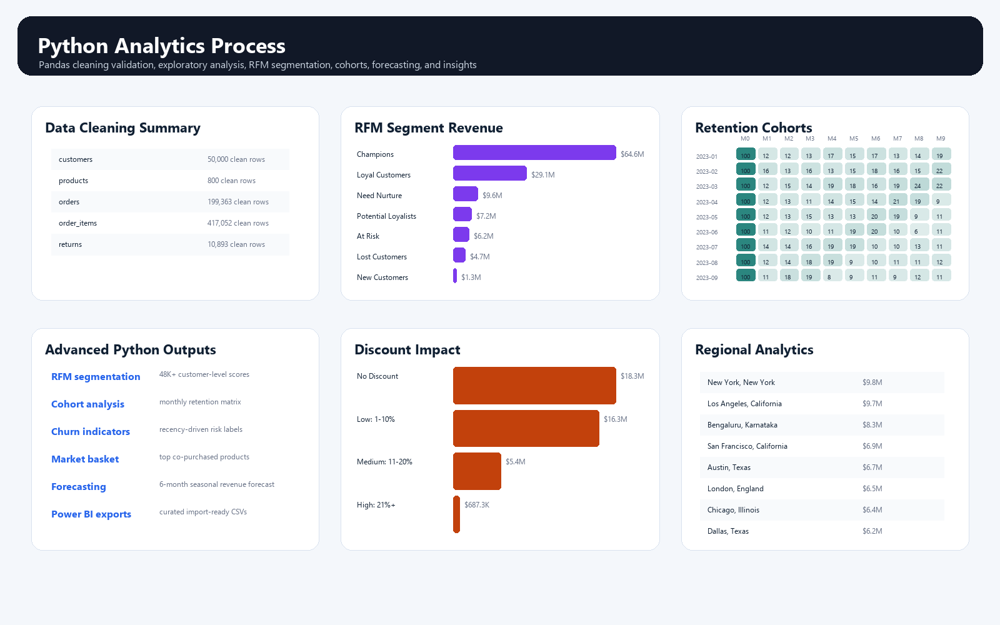

# E-commerce Customer Analytics & Revenue Optimization

A complete end-to-end business analytics project for an e-commerce company. The project uses SQL, Python/Pandas, and Power BI-ready assets to analyze customer behavior, revenue trends, retention patterns, product performance, discount impact, and regional growth opportunities.



## Project Overview

The goal of this project is to simulate a real-world analytics workflow for an online retail business. It starts with transactional e-commerce data, cleans and validates the data, loads it into a normalized database, performs advanced SQL analysis, builds customer analytics in Python, and prepares a Power BI dashboard model for stakeholder reporting.

Core business questions:

- Which customer segments generate the highest revenue?
- Which customers are at risk of churning?
- Which categories and products drive the most profit?
- Which months show peak sales performance?
- How do discounts affect revenue and margins?
- Which regions have the strongest sales and retention?
- How does repeat purchase behavior change over time?

## Dataset Used

This project uses a **custom simulated e-commerce transaction dataset** created specifically for this analytics case study. The dataset is generated with `src/generate_data.py` and is designed to resemble a realistic online retail environment with customers, orders, order items, products, and returns.

The dataset is not taken from a public Kaggle or marketplace source. It is a reproducible project dataset with controlled business logic, seasonality, product margins, discounts, returns, customer purchase tiers, and intentional raw-data quality issues for cleaning practice.

Dataset period: **January 2023 to December 2025**

| Table | Description | Clean Row Count |
|---|---|---:|
| `customers` | Customer profile, demographics, geography, signup date | 50,000 |
| `orders` | Order header data, dates, payment method, status, total amount | 199,363 |
| `order_items` | Product-level transaction lines, quantity, price, discount | 417,052 |
| `products` | Product catalog, category, sub-category, brand, cost, selling price | 800 |
| `returns` | Returned orders, return reasons, return dates | 10,893 |

## Business KPIs

| KPI | Value |
|---|---:|
| Total Revenue | `$122.7M` |
| Valid Orders | `181.5K` |
| Total Customers | `50.0K` |
| Average Order Value | `$676` |
| Repeat Customer Rate | `61.5%` |
| Return Rate | `5.5%` |

## Tech Stack

- **SQL:** PostgreSQL scripts and a runnable SQLite analytics database
- **Python:** Pandas, NumPy, OpenPyXL
- **Notebook:** Jupyter Notebook
- **Visualization:** Power BI-ready import tables, DAX measures, model guide, dashboard guide, and PNG previews
- **Reporting:** HTML analytics report and exported analysis tables

## Project Workflow



1. Generate realistic e-commerce source data.
2. Clean duplicates, nulls, inconsistent formats, dates, and referential issues.
3. Load normalized tables into a SQL database.
4. Run SQL analysis using joins, CTEs, aggregates, ranking, date functions, and window functions.
5. Build Python analytics outputs for EDA, RFM segmentation, churn indicators, cohort retention, forecasting, and market basket analysis.
6. Export Power BI-ready tables, DAX measures, data model documentation, dashboard guide, and screenshot previews.

## Data Model



The database follows a normalized relational model:

- `customers` connects to `orders` using `customer_id`
- `orders` connects to `order_items` using `order_id`
- `products` connects to `order_items` using `product_id`
- `returns` connects to `orders` using `order_id`

This structure supports clean SQL analysis, reliable KPI calculations, and a star-schema-friendly Power BI model.

## SQL Analysis



SQL scripts cover:

- Revenue analysis and monthly trends
- Year-over-year and month-over-month growth
- Average Order Value
- Revenue by category and sub-category
- Top-selling products
- New vs returning customers
- Customer lifetime value
- Repeat purchase behavior
- Churn candidate identification
- Product ranking within categories
- Profit margin analysis
- Discount impact
- Geographic revenue trends

Advanced SQL techniques used:

- Joins
- Common Table Expressions
- Window functions
- Ranking and dense ranking
- Aggregations
- Date functions
- Analytical views

## Python Analytics



Python/Pandas analysis includes:

- Data cleaning validation
- Exploratory data analysis
- Sales and order pattern analysis
- Category performance analysis
- RFM segmentation
- Customer churn indicators
- Monthly cohort retention
- Retention heatmap exports
- Market basket analysis
- Simple revenue forecasting
- Power BI import table preparation

RFM segments created:

- Champions
- Loyal Customers
- Potential Loyalists
- At Risk
- Lost Customers
- New Customers
- Need Nurture

## Power BI Dashboard

The project includes a complete Power BI dashboard blueprint and all import-ready data tables. The `.pbix` file is not included because Power BI Desktop is required to build and save the report file, but every required input for recreating the dashboard is available in the repository.

Dashboard assets:

- Import tables: `powerbi/import_tables/*.csv`
- Data model relationships: `powerbi/Data_Model.md`
- DAX KPI and analytics measures: `powerbi/DAX_Measures.md`
- Dashboard layout guide: `powerbi/Dashboard_Build_Guide.md`
- Report theme: `powerbi/powerbi_theme.json`
- Dashboard preview image: `assets/powerbi_dashboard_screenshot.png`

Recommended dashboard pages:

1. **Executive Overview:** Total Revenue, Total Orders, Total Customers, AOV, Repeat Customer Rate, Return Rate, revenue trend, and geographic revenue.
2. **Sales Dashboard:** monthly revenue, running revenue, MoM and YoY growth, payment method performance, category revenue, and discount impact.
3. **Customer Analytics:** RFM segments, churn indicators, repeat customer percentage, top customers, and regional customer trends.
4. **Cohort Dashboard:** acquisition cohort retention matrix, monthly repeat purchase trends, and retention heatmap.
5. **Product Performance:** top and bottom products, category contribution, profit margin analysis, and discount vs sales analysis.

Suggested Power BI build flow:

1. Import all CSV files from `powerbi/import_tables/`.
2. Create relationships using `powerbi/Data_Model.md`.
3. Add measures from `powerbi/DAX_Measures.md`.
4. Apply `powerbi/powerbi_theme.json`.
5. Build the five report pages using `powerbi/Dashboard_Build_Guide.md`.

## Repository Structure

```text
.
|-- assets/                   # README screenshots and dashboard previews
|-- data/
|   |-- raw/                  # source data with intentional quality issues
|   `-- processed/            # cleaned relational tables
|-- database/
|   `-- ecommerce_analytics.sqlite
|-- docs/
|   |-- data_dictionary.md
|   `-- project_architecture.md
|-- notebooks/
|   `-- ecommerce_customer_analytics.ipynb
|-- outputs/
|   |-- sql/                  # SQL query result CSVs
|   |-- tables/               # Python analytics outputs
|   |-- figures/              # SVG chart assets
|   `-- report/               # HTML analytics report
|-- powerbi/
|   |-- import_tables/        # Power BI import-ready tables
|   |-- DAX_Measures.md
|   |-- Dashboard_Build_Guide.md
|   |-- Data_Model.md
|   `-- powerbi_theme.json
|-- sql/
|   |-- 01_schema_postgresql.sql
|   |-- 02_data_cleaning_postgresql.sql
|   |-- 03_analysis_queries_postgresql.sql
|   |-- 04_views_postgresql.sql
|   |-- sqlite_schema.sql
|   `-- sqlite_views.sql
`-- src/
    |-- generate_data.py
    |-- clean_data.py
    |-- build_database.py
    |-- run_sql_analysis.py
    |-- python_analysis.py
    |-- create_notebook.py
    |-- create_dashboard_screenshot.py
    |-- create_process_screenshots.py
    `-- run_pipeline.py
```

## Key Deliverables

- SQL schema, cleaning checks, analytical queries, and views
- SQLite database with normalized tables and relationships
- Python notebook for EDA, RFM segmentation, churn indicators, and cohort analysis
- Power BI-ready import tables
- DAX measure library
- Power BI data model and dashboard build guide
- HTML analytics report
- Business insight exports
- Process and dashboard screenshots for portfolio presentation

## Main Outputs

- `database/ecommerce_analytics.sqlite`
- `notebooks/ecommerce_customer_analytics.ipynb`
- `outputs/sql/*.csv`
- `outputs/tables/analytics_export.xlsx`
- `outputs/tables/business_insights.json`
- `outputs/report/ecommerce_analytics_report.html`
- `powerbi/import_tables/*.csv`
- `powerbi/DAX_Measures.md`
- `powerbi/Data_Model.md`
- `powerbi/Dashboard_Build_Guide.md`

## How to Run

Install dependencies:

```powershell
pip install -r requirements.txt
```

Run the full project pipeline:

```powershell
python src/run_pipeline.py
```

Optional screenshot generation:

```powershell
python src/create_dashboard_screenshot.py
python src/create_process_screenshots.py
```

## Project Outcome

The final output is a portfolio-ready analytics solution that demonstrates:

- Data modeling and database design
- SQL analytics for business reporting
- Python-based customer and retention analytics
- RFM segmentation and churn analysis
- Cohort retention measurement
- Revenue and profit optimization analysis
- Power BI dashboard planning and KPI design
