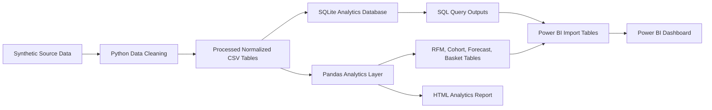

# Project Architecture

## Workflow

## Data Generation

The project creates a realistic transaction history across 2023-2025 with seasonal demand, customer purchase tiers, multi-item orders, returns, cancellation statuses, geography, product categories, product costs, selling prices, and discount behavior.

Intentional raw data issues are injected to make the cleaning workflow meaningful:

- Duplicate rows
- Minor inconsistent string formats
- Missing customer names and cities
- Missing product brand values
- Payment method formatting variations

## Data Cleaning

`src/clean_data.py` performs:

- Duplicate row and duplicate primary-key removal
- String standardization
- Gender and payment method normalization
- Missing value imputation
- Date parsing
- Numeric type conversion
- Discount range validation
- Referential integrity filtering
- Order total recalculation from order-item lines

## Database Layer

`src/build_database.py` loads processed CSVs into `database/ecommerce_analytics.sqlite` with normalized tables, primary keys, foreign keys, indexes, and analytical views.

The `sql/` directory also includes PostgreSQL schema and analysis scripts for a portfolio-grade SQL implementation.

## Analytics Layer

`src/run_sql_analysis.py` executes SQL queries covering:

- Total revenue, order count, AOV, repeat rate
- Monthly revenue, MoM growth, YoY growth, running total
- Revenue and profit by category/sub-category
- Product rankings and dense ranks within category
- New vs returning customers
- Customer lifetime value
- Churn candidate identification
- Discount impact
- Geographic revenue

`src/python_analysis.py` performs:

- EDA summary table exports
- RFM segmentation
- Cohort retention analysis
- Churn scoring
- Discount analysis
- Regional retention analysis
- Market basket pair analysis
- Simple seasonal sales forecasting
- Power BI table exports
- HTML report generation

## Power BI Layer

Power BI should import the tables in `powerbi/import_tables/`, apply relationships from `powerbi/Data_Model.md`, add DAX measures from `powerbi/DAX_Measures.md`, and use the layout in `powerbi/Dashboard_Build_Guide.md`.

